```python
import numpy as np
L=[1,2,3]
A = np.array([1,2,3])
L
A**2   
np.sqrt(A)
```


    array([ 1.        ,  1.41421356,  1.73205081])


```python
# Dot product
a = np.array([1,2])
b = np.array([2,1])

a*b
np.sum(a*b)
np.dot(a,b)
a.dot(b)
```


    4


```python
M = np.array([[1,2],[3,4]])
M
```


    array([[1, 2],
           [3, 4]])


```python
L=[[1,2],[3,4]]
L
```


    [[1, 2], [3, 4]]


```python
M.T
```


    array([[1, 3],
           [2, 4]])


```python
Z=np.zeros(10)
Z
```


    array([ 0.,  0.,  0.,  0.,  0.,  0.,  0.,  0.,  0.,  0.])


```python
Z=np.zeros((10,10))
Z
```


    array([[ 0.,  0.,  0.,  0.,  0.,  0.,  0.,  0.,  0.,  0.],
           [ 0.,  0.,  0.,  0.,  0.,  0.,  0.,  0.,  0.,  0.],
           [ 0.,  0.,  0.,  0.,  0.,  0.,  0.,  0.,  0.,  0.],
           [ 0.,  0.,  0.,  0.,  0.,  0.,  0.,  0.,  0.,  0.],
           [ 0.,  0.,  0.,  0.,  0.,  0.,  0.,  0.,  0.,  0.],
           [ 0.,  0.,  0.,  0.,  0.,  0.,  0.,  0.,  0.,  0.],
           [ 0.,  0.,  0.,  0.,  0.,  0.,  0.,  0.,  0.,  0.],
           [ 0.,  0.,  0.,  0.,  0.,  0.,  0.,  0.,  0.,  0.],
           [ 0.,  0.,  0.,  0.,  0.,  0.,  0.,  0.,  0.,  0.],
           [ 0.,  0.,  0.,  0.,  0.,  0.,  0.,  0.,  0.,  0.]])


```python
G=np.random.randn(10,10)

```


```python
x=[]
for line in open("data_2d.csv"):
    row = line.split(',')
    sample = map(float,row)
    x.append(sample)

```


```python
import pandas as pd

X = pd.read_csv("data_2d.csv",header=None)
X.info()
X.head()

```

    <class 'pandas.core.frame.DataFrame'>
    RangeIndex: 100 entries, 0 to 99
    Data columns (total 3 columns):
    0    100 non-null float64
    1    100 non-null float64
    2    100 non-null float64
    dtypes: float64(3)
    memory usage: 2.4 KB


<div>
<table border="1" class="dataframe">
  <thead>
    <tr style="text-align: right;">
      <th></th>
      <th>0</th>
      <th>1</th>
      <th>2</th>
    </tr>
  </thead>
  <tbody>
    <tr>
      <th>0</th>
      <td>17.930201</td>
      <td>94.520592</td>
      <td>320.259530</td>
    </tr>
    <tr>
      <th>1</th>
      <td>97.144697</td>
      <td>69.593282</td>
      <td>404.634472</td>
    </tr>
    <tr>
      <th>2</th>
      <td>81.775901</td>
      <td>5.737648</td>
      <td>181.485108</td>
    </tr>
    <tr>
      <th>3</th>
      <td>55.854342</td>
      <td>70.325902</td>
      <td>321.773638</td>
    </tr>
    <tr>
      <th>4</th>
      <td>49.366550</td>
      <td>75.114040</td>
      <td>322.465486</td>
    </tr>
  </tbody>
</table>
</div>


```python
X.iloc[0]
```


    0     17.930201
    1     94.520592
    2    320.259530
    Name: 0, dtype: float64


```python
%matplotlib inline
```


```python
import matplotlib.pyplot as plt

x = np.linspace(0,10,100)
y = np.sin(x)

plt.plot(y)

```


    [<matplotlib.lines.Line2D at 0x7fd50509aac8>]


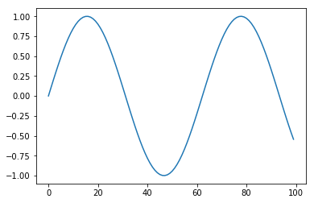


```python
plt.plot(x,y)
plt.xlabel("Time")
plt.ylabel("Some function of time")
plt.title("Chart")
```


    <matplotlib.text.Text at 0x7fd504fbd860>


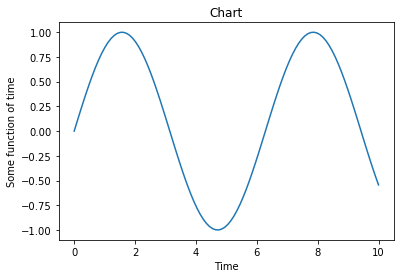


```python
import pandas as pd

A = pd.read_csv('data_1d.csv',header=None).as_matrix()
x=A[:,0]
y=A[:,1]

plt.scatter(x,y)
```


    <matplotlib.collections.PathCollection at 0x7fd504f0dc50>


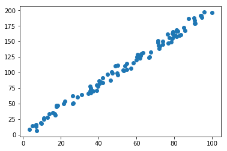


```python
x_line = np.linspace(0,100,100)
y_line = 2*x_line+1
plt.scatter(x_line,y_line)
```


    <matplotlib.collections.PathCollection at 0x7fd504eab9e8>


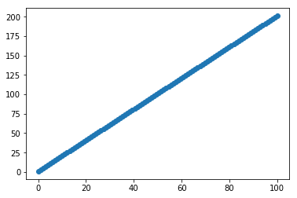


```python

A = pd.read_csv('data_1d.csv',header=None).as_matrix()
x=A[:,0]
y=A[:,1]

plt.hist(x)
```


    (array([ 10.,   9.,   5.,  13.,  10.,  10.,   8.,  16.,  10.,   9.]),
     array([  3.21124861,  12.88597188,  22.56069515,  32.23541842,
             41.91014169,  51.58486496,  61.25958823,  70.9343115 ,
             80.60903477,  90.28375804,  99.95848131]),
     <a list of 10 Patch objects>)


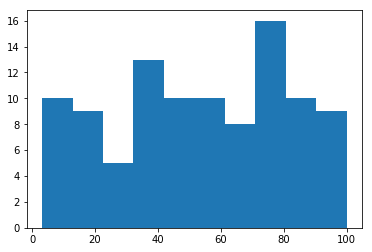


```python
R = np.random.random(10000)
plt.hist(R)
```


    (array([ 1011.,   951.,  1050.,   970.,  1055.,   965.,  1055.,   955.,
              970.,  1018.]),
     array([  7.70987562e-06,   1.00001045e-01,   1.99994379e-01,
              2.99987714e-01,   3.99981049e-01,   4.99974384e-01,
              5.99967718e-01,   6.99961053e-01,   7.99954388e-01,
              8.99947723e-01,   9.99941057e-01]),
     <a list of 10 Patch objects>)


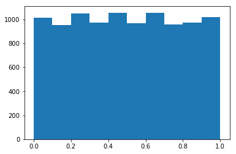


```python
plt.hist(R,bins=20)
```


    (array([ 498.,  513.,  494.,  457.,  546.,  504.,  476.,  494.,  533.,
             522.,  489.,  476.,  531.,  524.,  497.,  458.,  473.,  497.,
             484.,  534.]),
     array([  7.70987562e-06,   5.00043772e-02,   1.00001045e-01,
              1.49997712e-01,   1.99994379e-01,   2.49991047e-01,
              2.99987714e-01,   3.49984381e-01,   3.99981049e-01,
              4.49977716e-01,   4.99974384e-01,   5.49971051e-01,
              5.99967718e-01,   6.49964386e-01,   6.99961053e-01,
              7.49957720e-01,   7.99954388e-01,   8.49951055e-01,
              8.99947723e-01,   9.49944390e-01,   9.99941057e-01]),
     <a list of 20 Patch objects>)


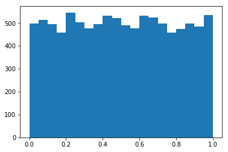


```python
y_actual = 2*x+1
residuals = y-y_actual
plt.hist(residuals)
```


    (array([  6.,   7.,  15.,  14.,  12.,  18.,  13.,   7.,   6.,   2.]),
     array([ -9.78834827,  -7.57337797,  -5.35840768,  -3.14343738,
             -0.92846708,   1.28650321,   3.50147351,   5.7164438 ,
              7.9314141 ,  10.14638439,  12.36135469]),
     <a list of 10 Patch objects>)


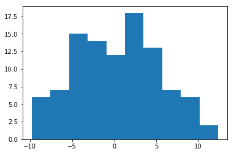


```python
import pandas as pd
df = pd.read_csv("../large_files/train.csv")
df.shape

M = df.as_matrix()

im = M[9,1:]

im.shape

im = im.reshape(28,28)
im.shape
M[0,0]
plt.imshow(im)
```


    <matplotlib.image.AxesImage at 0x7fd502ecea20>


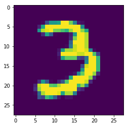


```python
plt.imshow(im,cmap='gray')
```


    <matplotlib.image.AxesImage at 0x7fd504aeaac8>


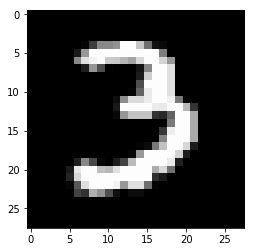


```python
plt.imshow(256-im,cmap='gray')
```


    <matplotlib.image.AxesImage at 0x7fd504a7a470>


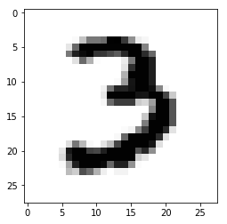

